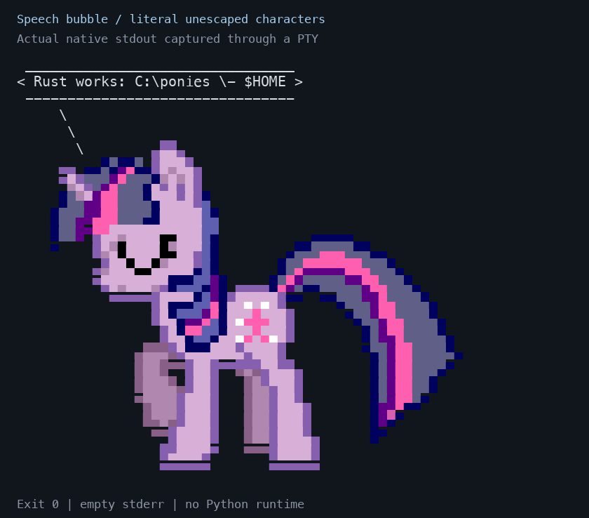

# ponysay-rust

A native Rust rewrite of the ponysay command and renderer, maintained in
[jcpsimmons/ponysay-rust](https://github.com/jcpsimmons/ponysay-rust). It uses the original
ponies, aliases, quotes, balloon styles, and `.pony` format. Artwork is compiled
into the executable. Running it requires neither Python nor Homebrew.

This is an independent fork of [erkin/ponysay](https://github.com/erkin/ponysay),
not a transfer of the original project's ownership. Original Python source and
history remain available for reference and asset tooling.



## Install

```sh
git clone https://github.com/jcpsimmons/ponysay-rust.git
cd ponysay-rust
./install-rust.sh
export PATH="$HOME/.local/bin:$PATH"
ponysay -f twilight 'Friendship is magic!'
ponythink -f luna 'Native ponies.'
```

The script builds with the committed Cargo lockfile, installs
`~/.local/bin/ponysay-rust`, and creates `ponysay` and `ponythink` aliases. Pass another prefix as
the first argument to change the installation directory. Rust 1.85 or newer is
required to build. The native binary carries its assets with it and works outside
the checkout.

If your shell startup contains an absolute Homebrew path, replace that specific
invocation with `"$HOME/.local/bin/ponysay"`. Changing `PATH` alone cannot override
an absolute path. After testing the replacement, `brew uninstall ponysay` removes
the old package.

## Homebrew

The separately named formula lives in our own tap:

```sh
brew install jcpsimmons/tap/ponysay-rust
ponysay-rust -f twilight "Hello from Rust"
ponythink-rust "A thought"
```

The tap installs namespaced commands that can coexist with Homebrew's original
`ponysay`. To opt into the conventional names, put the formula's aliases first:

```sh
export PATH="$(brew --prefix ponysay-rust)/libexec/bin:$PATH"
```

This is third-party tap distribution, not inclusion in `homebrew/core`. Homebrew's
[separately named fork policy](https://docs.brew.sh/Acceptable-Formulae#forks) permits
a distinct identity, but core admission still requires the package to meet its
release, adoption, maintenance and licensing criteria.

## Use

```sh
ponysay 'A random pony says this.'
printf '%s\n' 'Input from a pipe' | ponysay
ponysay -f pinkie -f twilight 'Choose one of these ponies.'
ponysay -q twilight
ponysay -l
ponysay -A
ponysay -B
ponysay -b round -f twilight 'Custom balloon style'
ponysay -W 40 'A message wrapped to fit.'
ponysay -W n -- 'Literal text: C:\ponies, $HOME, and \-'
ponysay --no-color -f twilight 'Plain output'
ponysay -i -f twilight
ponysay -o -f twilight
```

Messages are literal text. Backslashes, shell-looking strings, quotes, and dollar
signs are never interpreted as code or pony-template directives. Unicode width
and ANSI escapes are handled by the renderer. `NO_COLOR` disables color. A broken
output pipe exits cleanly.

Custom assets in `$XDG_DATA_HOME/ponysay`, `~/.local/share/ponysay`, or directories
given with `--data-dir` / `PONYSAY_DATA_DIR` override the bundled assets. Use the
subdirectories `ponies`, `extraponies`, `ttyponies`, `extrattyponies`, `quotes`,
and `balloons`. A direct `.pony`, `.say`, or `.think` path also works.

## Compatibility

The native version implements speech/thought balloons, normal and extra pony
collections, aliases, quotes, metadata, custom artwork and styles, multiline and
wrapped messages, compact messages, pony-only output, and Linux-console artwork.
Run `ponysay --help` for the supported CLI.

Python extension/configuration execution hooks, automatic PNG conversion, Linux
KMS palette programming, spelling correction, the metadata restriction language,
and legacy per-component color override flags are not implemented by the native
CLI. Unsupported options produce an error. `ponysay-tool` remains original Python
asset tooling; it is not installed by the Rust installer. Python is never used as
a runtime fallback.

Homebrew's 3.0.3 Python archive emits `SyntaxWarning` messages about invalid escape
sequences on recent Python. This fork already contains the source-level escape
fix, and the Rust executable removes Python from the startup path entirely.

## Verify and benchmark

```sh
cargo fmt --check
cargo clippy --locked --all-targets -- -D warnings
cargo test --locked
cargo build --release --locked
python3 rust/tests/cli.py
python3 rust/tests/render_parity.py --include-tty
python3 rust/tests/benchmark.py --baseline /path/to/python/ponysay
```

The benchmark runs complete processes, captures output, alternates the two
implementations, and records all samples plus environment details in
`rust/benchmarks/startup.json`. It measures command latency, including interpreter
startup and rendering, rather than timing only a selected Rust function.

Measured on macOS ARM64, 30 alternating runs per workload after two warmups.
These are warm-cache process medians, including startup and rendering.

| Workload | Homebrew Python | Rust | Speedup |
| --- | ---: | ---: | ---: |
| shell greeting | 60.61 ms | 2.77 ms | 21.9x |
| multiline stdin | 61.51 ms | 2.78 ms | 22.1x |
| wrapped paragraph | 64.86 ms | 2.86 ms | 22.7x |

Raw samples and the exact flags are in [startup.json](rust/benchmarks/startup.json).
Wrapping has native Unicode behavior; this timing is not a claim of byte-identical
output for every historical Python wrapping edge case.

## Visual verification

Actual PTY captures were rendered with a terminal emulator and inspected for
speech, thought and embedded balloons. These are renderings of executable
output, not screenshots of a desktop Terminal application.

- [Speech and literal backslashes](rust/visual-checks/speech.png)
- [Thoughts and multiple lines](rust/visual-checks/thought.png)
- [Embedded balloon](rust/visual-checks/embedded.png)

The raw `.ansi` captures and the generator `rust/tests/visual.py` are included.

The test suite covers 1,154 bundled pony paths and all eight balloon styles.
The differential harness makes 1,204 direct comparisons to the retained Python
renderer and checks two known upstream TTY rendering failures against their
equivalent xterm artwork. All 1,206 checks pass. Normal wrapping matches; Unicode
width, minimum-height behavior, and long-word wrapping include documented fixes.

## License and attribution

The program is GPL-3.0-or-later; see [COPYING](COPYING), [LICENSE](LICENSE), and
[CREDITS](CREDITS). Original authors include Erkin Batu Altunbaş, Mattias Andrée,
Elis Axelsson, Sven-Hendrik Haase, Jan Alexander Steffens, and Kyah Rindlisbacher.
The Rust implementation preserves original image metadata and credits.

Individual artwork retains its original licensing conditions. Some assets are
marked `FREE: no`; bundling them does not relicense them or grant commercial
redistribution rights. Consult each image's metadata and the original license
files before redistributing an artwork collection.
